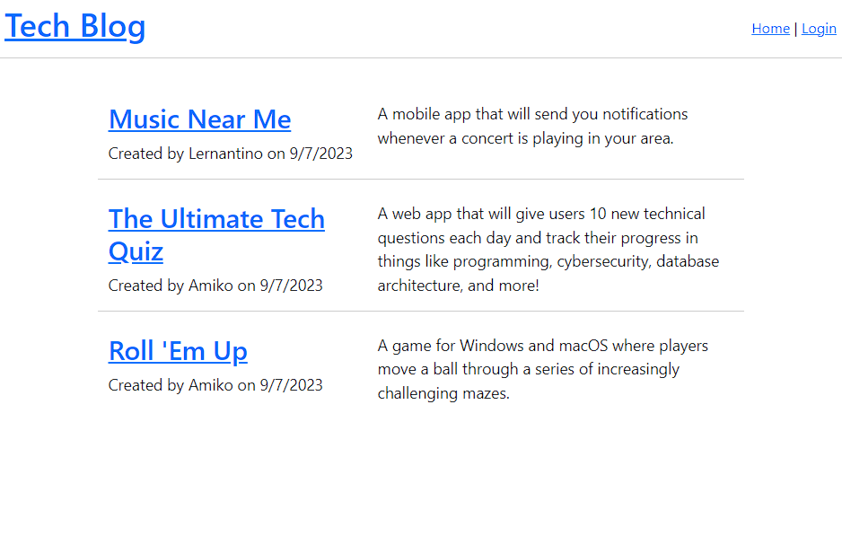

# Tech Blog

## Description

This is a full stack project written and developed by Yoon-Jae Kim. Parts of the code here were lifted from the Mini-Project of Module 14 of the NW Coding Bootcamp.

The purpose of this was project is to solidfy the MVC model concept by having us create a fully functional website from scratch. The website is a simple tech blog that allows users to login, sign up, post blogposts, and comment on said blogposts. 

The Models for this project boil down to three separate tables, Users, Posts, and Comments. The Views are handled by Handlebar and pull Models via the Controller, handled by Express.

## Table of Contents
- [Installation](#installation)
- [Usage](#usage)
- [Credits](#credits)
- [License](#license)
- [How to Contribute](#how-to-contribute)
- [Tests](#tests)

## Installation
You can demo this project by following the deployed heroku link. Another option would be to clone this onto your local machine and run it after seeding the database and installing the necessary packages using 'npm run seed' and 'npm i', respectively. Please be sure to have MySQL running and to fill out the .env file with your db credentials  before you do so. 

## Usage
This project can be used by anyone looking to streamline their README creation process.

## Credits
### Github
[Yoonbacca](https://github.com/Yoonbacca)
### Email
[yoonjaekim3@gmail.com](yoonjaekim3@gmail.com)

## License
None

## How to Contribute
This is a solo project and does not require contributions at this time.

  